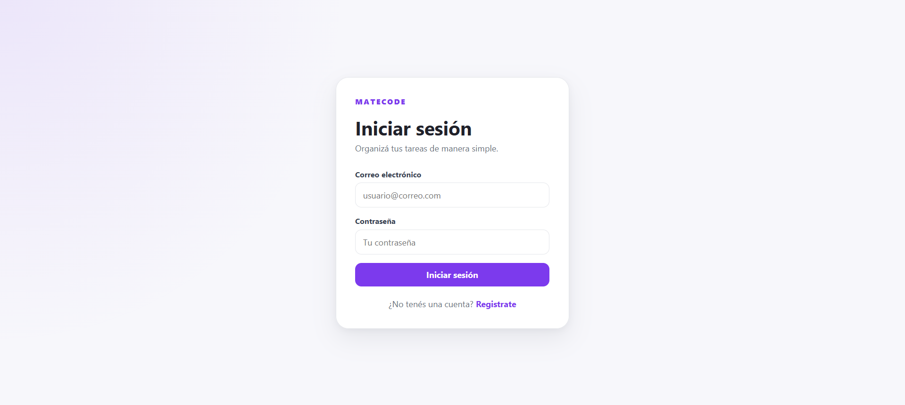
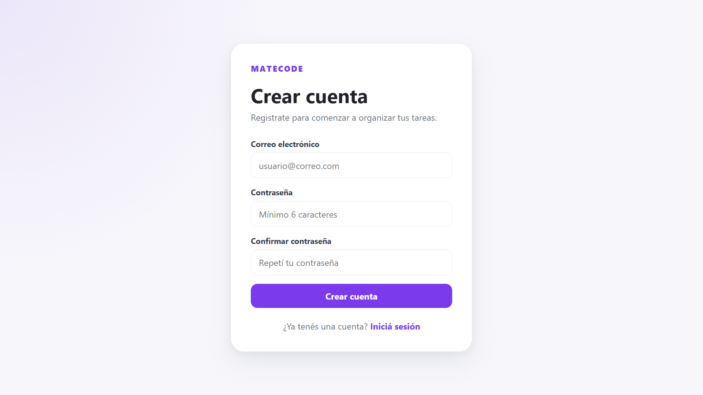
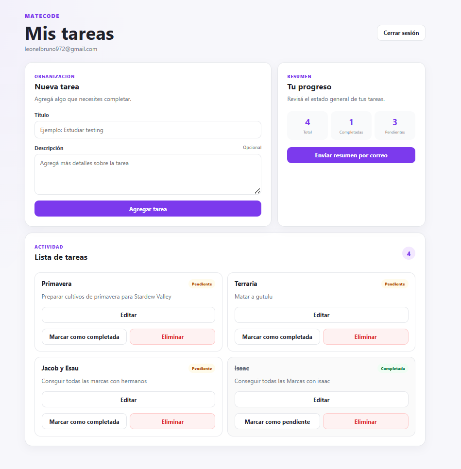

# MateCode Task Manager

Aplicación web para organizar tareas personales, desarrollada con React, TypeScript, Firebase, Vercel Functions y Amazon SES.

Permite crear una cuenta, iniciar sesión, administrar tareas en tiempo real y recibir un resumen por correo electrónico.

## Aplicación desplegada

[Ver MateCode en producción](https://metacode-task-manager.vercel.app)

## Repositorio

[Ver repositorio en GitHub](https://github.com/Leonelbruno/metacode-task-manager)

---

## Índice

- [Capturas de pantalla](#capturas-de-pantalla)
- [Funcionalidades](#funcionalidades)
- [Tecnologías utilizadas](#tecnologías-utilizadas)
- [Arquitectura del proyecto](#arquitectura-del-proyecto)
- [Flujo general de la aplicación](#flujo-general-de-la-aplicación)
- [Instalación local](#instalación-local)
- [Comandos disponibles](#comandos-disponibles)
- [Tests](#tests)
- [Seguridad](#seguridad)
- [Variables de entorno en Vercel](#variables-de-entorno-en-vercel)
- [Limitaciones actuales](#limitaciones-actuales)
- [Uso de inteligencia artificial](#uso-de-inteligencia-artificial)
- [Autor](#autor)

---

## Capturas de pantalla

### Inicio de sesión



### Registro de usuario



### Panel de tareas en computadora



---

## Funcionalidades

- Registro de usuarios con correo electrónico y contraseña.
- Inicio y cierre de sesión.
- Persistencia de sesión al recargar la página.
- Protección de rutas privadas.
- Creación de tareas.
- Lectura de tareas en tiempo real.
- Edición de título y descripción.
- Cambio de estado entre pendiente y completada.
- Eliminación de tareas con confirmación.
- Separación de tareas por usuario.
- Resumen de tareas completadas y pendientes.
- Envío del resumen por correo electrónico.
- Manejo de estados de carga y mensajes de error.
- Diseño responsive y mobile-first.

---

## Tecnologías utilizadas

### Frontend

- React
- TypeScript
- Vite
- React Router
- CSS mobile-first

### Backend y servicios

- Firebase Authentication
- Cloud Firestore
- Vercel Functions
- Amazon Simple Email Service
- AWS SDK para JavaScript

### Testing

- Vitest
- React Testing Library
- Testing Library User Event
- Jest DOM
- JSDOM

### Despliegue

- Vercel
- GitHub

---

## Arquitectura del proyecto

```text
metacode-task-manager/
├── api/
│   └── send-summary.ts
├── docs/
│   └── images/
├── src/
│   ├── components/
│   │   └── tasks/
│   │       ├── TaskForm.tsx
│   │       ├── TaskForm.test.tsx
│   │       ├── TaskItem.tsx
│   │       └── TaskItem.test.tsx
│   ├── context/
│   │   └── AuthContext.tsx
│   ├── pages/
│   │   ├── LoginPage.tsx
│   │   ├── RegisterPage.tsx
│   │   └── TasksPage.tsx
│   ├── routes/
│   │   ├── AppRouter.tsx
│   │   └── ProtectedRoute.tsx
│   ├── services/
│   │   ├── authService.ts
│   │   ├── emailService.ts
│   │   ├── emailService.test.ts
│   │   ├── firebase.ts
│   │   └── taskService.ts
│   ├── test/
│   │   └── setup.ts
│   ├── types/
│   │   └── Task.ts
│   ├── index.css
│   └── main.tsx
├── .env.example
├── package.json
├── vercel.json
├── vite.config.ts
└── vitest.config.ts
```

---

## Flujo general de la aplicación

1. El usuario crea una cuenta o inicia sesión mediante Firebase Authentication.
2. Firebase mantiene la sesión activa mientras el usuario navega o recarga la aplicación.
3. Las rutas privadas verifican que exista un usuario autenticado.
4. Las tareas se almacenan en Cloud Firestore.
5. Cada tarea contiene el identificador del usuario que la creó.
6. La interfaz recibe actualizaciones en tiempo real mediante un listener de Firestore.
7. Al solicitar un resumen, el frontend llama a una Vercel Function.
8. La función utiliza Amazon SES para enviar el correo sin exponer las credenciales de AWS en el navegador.

---

## Instalación local

### 1. Clonar el repositorio

```bash
git clone https://github.com/Leonelbruno/metacode-task-manager.git
cd metacode-task-manager
```

### 2. Instalar dependencias

```bash
npm install
```

### 3. Crear las variables de entorno

Crear un archivo `.env.local` en la raíz del proyecto.

```env
VITE_FIREBASE_API_KEY=
VITE_FIREBASE_AUTH_DOMAIN=
VITE_FIREBASE_PROJECT_ID=
VITE_FIREBASE_STORAGE_BUCKET=
VITE_FIREBASE_MESSAGING_SENDER_ID=
VITE_FIREBASE_APP_ID=

AWS_REGION=
AWS_ACCESS_KEY_ID=
AWS_SECRET_ACCESS_KEY=
AWS_SES_FROM_EMAIL=
```

Los valores reales no deben guardarse en GitHub.

Las variables que comienzan con `VITE_` son utilizadas por el frontend. Las credenciales de AWS solamente deben utilizarse desde la función del servidor.

### 4. Iniciar el frontend

```bash
npm run dev
```

La aplicación estará disponible normalmente en:

```text
http://localhost:5173
```

El envío de correos utiliza una Vercel Function, por lo que esa funcionalidad se ejecuta completamente en el entorno desplegado de Vercel.

---

## Comandos disponibles

### Iniciar desarrollo

```bash
npm run dev
```

### Generar build de producción

```bash
npm run build
```

### Ejecutar todos los tests

```bash
npm run test
```

### Ejecutar tests en modo observación

```bash
npm run test:watch
```

### Analizar el código con ESLint

```bash
npm run lint
```

---

## Tests

El proyecto contiene pruebas de componentes y servicios.

Actualmente se ejecutan:

- 2 tests para `TaskForm`.
- 3 tests para `TaskItem`.
- 2 tests para `emailService`.

Resultado actual:

```text
Test Files  3 passed
Tests       7 passed
```

### Comportamientos comprobados

- Escritura y envío del formulario de tareas.
- Estado deshabilitado durante la creación.
- Cambio de una tarea a completada.
- Manejo de errores al actualizar una tarea.
- Edición del título y la descripción.
- Envío correcto del resumen.
- Manejo de respuestas fallidas del servidor.

Los servicios externos son simulados durante los tests. Las pruebas no modifican Firestore ni envían correos reales.

---

## Seguridad

- Las claves de AWS no se encuentran en el frontend.
- Las credenciales privadas no se guardan en GitHub.
- El correo se envía desde una función ejecutada en el servidor.
- Las rutas de tareas requieren una sesión activa.
- Las consultas de Firestore filtran las tareas por usuario.
- Las reglas de Firestore restringen el acceso según el identificador del usuario autenticado.
- El usuario solamente puede crear, consultar, modificar o eliminar sus propias tareas.

---

## Variables de entorno en Vercel

Las variables de producción se almacenan directamente en Vercel.

### Firebase

```text
VITE_FIREBASE_API_KEY
VITE_FIREBASE_AUTH_DOMAIN
VITE_FIREBASE_PROJECT_ID
VITE_FIREBASE_STORAGE_BUCKET
VITE_FIREBASE_MESSAGING_SENDER_ID
VITE_FIREBASE_APP_ID
```

### Amazon SES

```text
AWS_REGION
AWS_ACCESS_KEY_ID
AWS_SECRET_ACCESS_KEY
AWS_SES_FROM_EMAIL
```

Las claves de acceso de AWS se configuraron como variables sensibles.

---

## Limitaciones actuales

### Amazon SES Sandbox

Amazon SES se encuentra en modo Sandbox.

Por esta razón, el envío de resúmenes solamente funciona cuando el destinatario también fue verificado previamente en Amazon SES.

Para enviar correos a cualquier destinatario sería necesario solicitar a AWS el acceso de producción de SES.

### Verificación del correo del usuario

Firebase permite crear una cuenta cuando el texto ingresado tiene formato de correo electrónico, aunque la dirección no exista realmente.

El proyecto todavía no implementa el envío y la confirmación de un correo de verificación.

### Tamaño del bundle

Vite muestra una advertencia porque el archivo JavaScript principal supera los 500 kB después de la minificación.

La aplicación funciona correctamente, pero en una versión futura se podría implementar división de código mediante importaciones dinámicas.

---

# Uso de inteligencia artificial

La inteligencia artificial se utilizó como herramienta de apoyo durante el desarrollo.

Las propuestas generadas fueron revisadas, adaptadas y comprobadas mediante ejecución local, tests automáticos y pruebas en producción.

## Caso 1: Creación de tests para TaskForm

### Prompt

> como hago para probar TaskForm con Vitest y React Testing Library si el componente esta  recibiendo el título y la descripción mediante props??

### Respuesta de la IA

> Se puede crear un pequeño componente contenedor para los tests. Ese componente utiliza `useState`, pasa los valores al formulario y permite simular el comportamiento real del componente padre. Después se utiliza `userEvent` para escribir y hacer clic, y `vi.fn()` para comprobar el envío.

### Descripción de lo sucedido

Se creó un componente de prueba que controla el título y la descripción.

Luego se agregaron dos tests:

- Escritura y envío del formulario.
- Botón deshabilitado durante la creación.

Ambos tests se ejecutaron correctamente.

```text
TaskForm: 2 tests aprobados
```

---

## Caso 2: Simulación de Firestore en TaskItem

### Prompt

> como hago para probar lo que hace TaskItem sin cambiar los datos reales de Firebase???

### Respuesta de la IA

> Se pueden reemplazar temporalmente las funciones de `taskService` utilizando `vi.mock()`. De esta forma, los clics del usuario llaman a funciones simuladas y el test puede comprobar qué argumentos recibieron sin conectarse a Firestore.

### Descripción de lo sucedido

Se simularon las funciones:

```text
updateTaskCompletion
updateTaskDetails
deleteTask
```

Los tests comprobaron:

- Marcar una tarea como completada.
- Mostrar un mensaje cuando ocurre un error.
- Editar el título y la descripción.

Ninguna prueba modificó la base de datos real.

```text
TaskItem: 3 tests aprobados
```

---

## Caso 3: Revisión de una vulnerabilidad en React Router

### Prompt

> el proyecto sigue funcionando, pero al ejecutar `npm audit` aparecen dos vulnerabilidades de severidad alta relacionadas con React Router. La terminal me esta recomendando ejecutar `npm audit fix --force`, pero también me advierte que va a instalar una versión con cambios incompatibles. como tendria que solucionarlo sin romper el proyecto?

### Respuesta de la IA

> No se recomienda ejecutar `npm audit fix --force` automáticamente, porque puede instalar una versión incompatible y romper las rutas de la aplicación.
>
> Primero se debe revisar qué dependencia produce la advertencia y si la funcionalidad vulnerable es utilizada por el proyecto. Como MateCode es una SPA desarrollada con Vite y utiliza rutas declarativas, se propuso instalar una versión estable y compatible de React Router:
>
> ```bash
> npm install react-router-dom@6.30.4 --save-exact
> ```
>
> La opción `--save-exact` guarda la versión exacta en `package.json` y evita que una actualización automática instale nuevamente una versión problemática.
>
> Después del cambio se recomendó comprobar:
>
> ```bash
> npm audit
> npm run dev
> npm run test
> npm run build
> ```

### Descripción de lo sucedido

`npm audit` detectó una vulnerabilidad en la versión de React Router instalada inicialmente y propuso resolverla utilizando `npm audit fix --force`.

Esa opción no se ejecutó porque podía introducir cambios incompatibles en el proyecto.

En su lugar, se revisó la dependencia señalada y se instaló una versión estable de React Router compatible con la estructura de rutas utilizada por MateCode.

```bash
npm install react-router-dom@6.30.4 --save-exact
```

Después de modificar la dependencia se comprobó que:

- El proyecto continuara iniciando correctamente.
- Las rutas de login, registro y tareas siguieran funcionando.
- La protección de `/tasks` no se rompiera.
- Los tests continuaran aprobándose.
- El build de producción finalizara correctamente.

La intervención permitió resolver el problema de forma controlada, sin aceptar automáticamente una actualización potencialmente incompatible.

```text
Aplicación: funcionando
Rutas: funcionando
Tests: 7 aprobados
Build de producción: completado
npm audit fix --force: no ejecutado
```

---

## Decisiones y validación de las respuestas de IA

Las respuestas de inteligencia artificial no fueron aceptadas automáticamente.

Cada propuesta fue:

1. Leída y revisada.
2. Adaptada a la estructura del proyecto.
3. Probada localmente.
4. Verificada mediante Vitest.
5. Comprobada en el despliegue de producción.

La inteligencia artificial fue utilizada como asistente técnico, mientras que las decisiones, implementaciones y validaciones finales fueron realizadas durante el desarrollo del proyecto.

---

## Autor

**Leonel Garbriel Bruno Vera**

Proyecto integrador desarrollado durante el Módulo 4 de SoyHenry.
